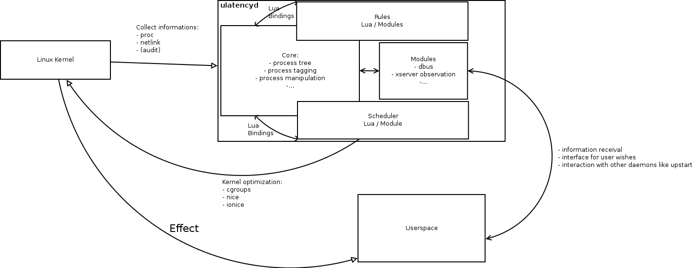

**This version of ulatencyd is considered abondend.**
A new version is under development using the based on rust and lua.

What is ulatency
================

Ulatency is a daemon that controls how the Linux kernel will spend it's
resources on the running processes. It uses dynamic cgroups to give the kernel
hints and limitations on processes.

It strongly supports the lua scripting language for writing rules and the
scheduler code.

### What tries it to fix

The Linux scheduler does a pretty good job to give the available resources to
all processes, but this may not be the best user experience in the desktop case.
ulatencyd monitors the system and categorizes the running processes into cgroups.
Processes that run wild to slow down the system by causing massive swaping will
be isolated.

### Isn't CONFIG_SCHED_DESKTOP enough ?

There is a patch for 2.6.38 in pipeline, see http://thread.gmane.org/gmane.linux.kernel/1050575

I think that this mimimal aproach is good for some circumstances, but does not
provide enough flexibility required for a true low latency desktop.
Perfect desktop scheduling needs a lot of heuristics, that don't belong in
the kernel. For example, the patch won't protect you from swap of death, fork bombs,
can't detect which process you are actually using and give more cpu shares to them,
can't give realtime priorities to processes like jackd, etc...

ulatencyd is designed for fixing exactly that.

Building
--------

### Build Requirements ###

  - libglib2.0-dev
  - libdbus-glib-1-dev
  - liblua5.1-0-dev | libluajit-5.1-dev
  - liblua5.1-posix1 (sometimes called luaposix)
  - libprocps 3.3.3 for static linkage (usually in libprocps-dev packages)
    or shared libprocps for dynamic linkage (requires patching to export
    enough symbols)

Cgroups release agent (optional):
  - dbus-send

Documentation:
  - doxygen
  - libmoose-perl
  - pandoc

CLI:
  - python-dbus
  - python2.5+ - python3.2+

GUI:
  - python-qt4
  - python-qt4-dbus

### Compiling ###

    $ cmake .
    $ make DEBUG=1

Configure options (optional):

    $ ccmake .

### Compilation troubleshooting (libprocps)

  ulatencyd needs some symbols that `libprocps` does not export, therefore
  you must either link to static libprocps or patch that library to
  export all needed symbols.

  By default ulatencyd satically links to libprocps.

  You can override location of static libprocps library and the include
  directory by setting `PROCPS_STATIC_LIBRARY` and `PROCPS_STATIC_INCLUDE_DIR`
  cmake variables. By default locations will be detected with help
  from pkg-config.

     PROCPS_STATIC_LIBRARY       specifies full path to the library
                                 (i.e. path to the libprocps.a file)
     PROCPS_STATIC_INCLUDE_DIR   specifies directory which contains
                                 the proc/procps.h header.

  e.g.:

    $ cmake -D PROCPS_STATIC_LIBRARY:FILEPATH=/path/to/libprocps.a \
            -D PROCPS_STATIC_INCLUDE_DIR:PATH=/path/to/include/dir .

  If you insist on dynamic linkage to shared libprocps, update or patch
  libprocps to export all symbols that application needs. CMake will
  output the list during configuration phase, alternatively you can get
  them from `CMakeLists.txt`. If you manage your solution to be persistent,
  future proof (in sense of API changes) and officially accepted by your
  GNU/Linux distribution, please contact ulatencyd authors.

  Dynamic linkage to shared libprocps may be enabled by setting
  `PROCPS_STATIC` to `OFF`, e.g.:

    $ cmake -D PROCPS_STATIC:BOOL=OFF .

  Location of shared libprocps and include dir may be overridden by
  cmake variable `PROCPS_SHARED_LIBRARY` and `PROCPS_SHARED_INCLUDE_DIR`.

### Building Documentation ###

    $ make docs

### Install ###

    $ sudo make install

Running
-------

    $ sudo /usr/local/sbin/ulatencyd -v -f /var/log/ulatencyd

Links
-----

- Website         -  https://github.com/poelzi/ulatencyd
- Infos           -  https://github.com/poelzi/ulatencyd/wiki
- FAQ             -  https://github.com/poelzi/ulatencyd/wiki/Faq
- Reporting Bugs  -  https://github.com/poelzi/ulatencyd/issues

Architecture
------------

The core of the daemon is written in c, embedding a lua interpreter.
Most of the rules are written in lua scripts, as heuristics for system behavior
can best be written in a script language.
The daemon exports system informations into lua script.

There are two ways implementing a heuristic behavior:
- using a timeout callback
- using a filter class

The timeout callback is called until it returns True.
The filter class is the preferred way. The filter gets executed on processes and
can categorize the process. 
Depending on the return value of the call the future behaviour may vary.
The return value consists of a flag section and i timeout section. The filter
is only executed after the timeout seconds.
It may also cause the filter to not be called on any child progress of the filter.

The processes are traveld in tree order. This means that the progress tree is 
mapped into the data structure and traveled from top (id = 1, which is the init)
and then trough all the children.

For more informations see [wiki](docs/wiki/Home.md).

